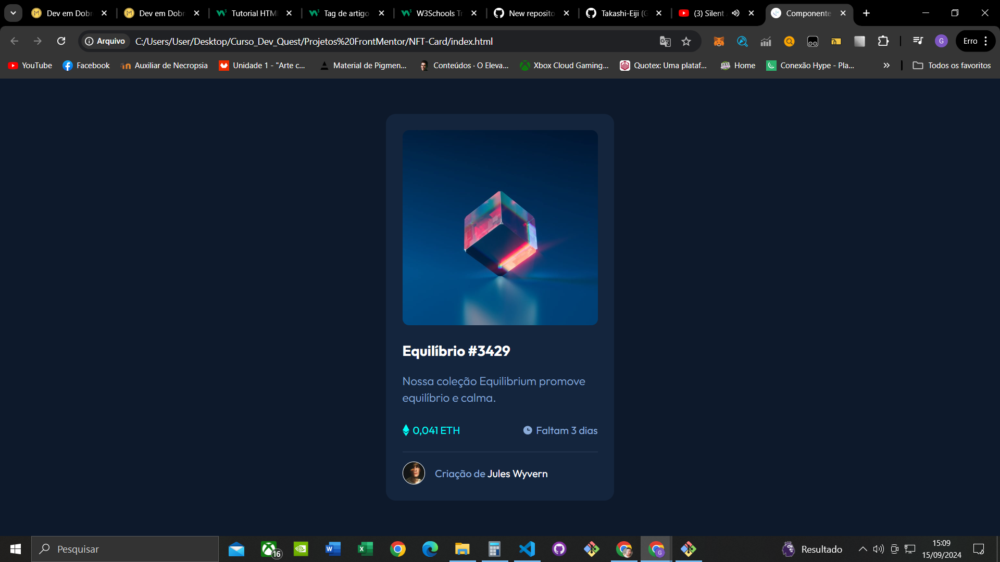
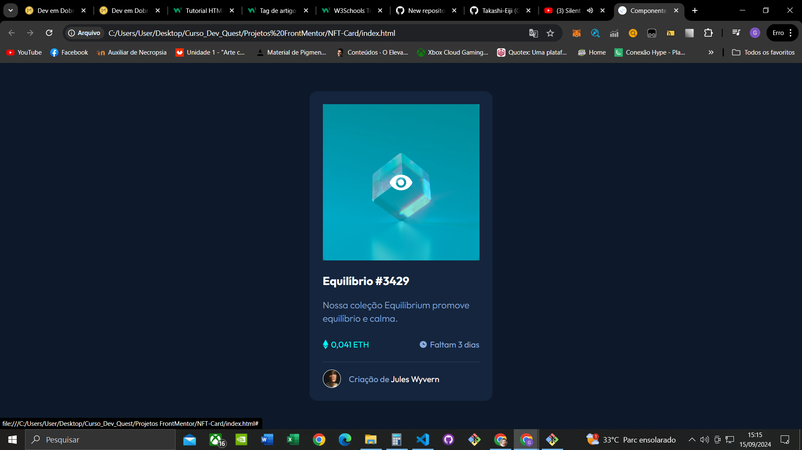
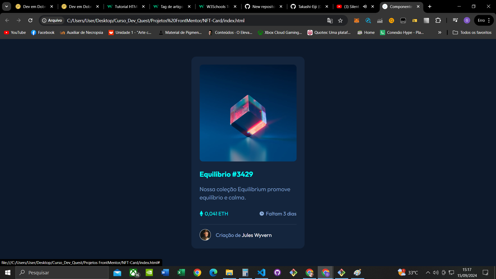
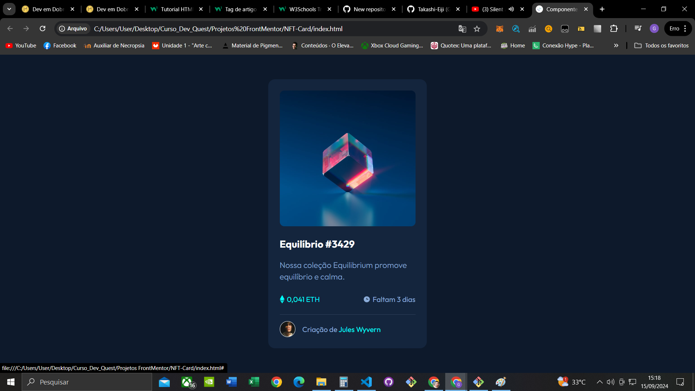

# Frontend Mentor - NFT Preview Card Component solution

Aqui apresento uma solução para o Desafio [NFT preview card component challenge on Frontend Mentor](https://www.frontendmentor.io/challenges/nft-preview-card-component-SbdUL_w0U) 

## Tabela de Conteúdos 
- [Visão Geral](#visão-geral)
- [O Desafio](#o-desafio)
- [Prints](#prints)
- [Meu Processo](#meu-processo)
- [Construído com](#construído-com)
- [O que aprendi](#o-que-aprendi)
- [Autor](#autor)
- [Agradecimentos](#agradecimentos)

## Visão Geral

### O Desafio

Os usuários devem ser capazes de:

- Veja o layout ideal dependendo do tamanho da tela do dispositivo

- Veja os estados de foco para elementos interativos

## Prints
### Resultado Final

### Elementos Interativos

### Responsivo

## Meu processo

Senti um leve desconforto no começo para fazer a montagem dos componentes necessários do container mas ao decorrer do desafio adquiria mais confiança e estabilidade ao codar algumas propriedades do css precisam ser memorizadas por mim(senti um leve desconforto no CSS).

Ao decorrer do desafio e de muito pesquisar ACREDITO EU que desenvolvi uma solução top e semântica para o DESAFIO! 

## Construido com
- [HTML]
- [CSS]

## O que eu aprendi

Aprendi que cada componente se utilizado da maneira correta pode automatizar e deixar mais adequado, não somente colocar um DIV ali e tudo bem mas a trabalhar mais a SEMÂNTICA do código para que ele se desenvolva mais completo e com alta RESPONSIVIDADE para os diversos dispositivos de acesso.

(minha confiança com HTML e CSS avança 1 degrau)

## Autor

- linkedin - [Gabriel-Souza/Takashi-Eiji](https://www.linkedin.com/in/gabriel-souza-b70074262/)
- Frontend Mentor - [@Takashi-Eiji](https://www.frontendmentor.io/profile/Takashi-Eiji)
- Instagram - [@biel_h_souza](https://www.instagram.com/biel_h_souza/)

## Agradecimentos 

Gostaria de Agradecer ao Frontend Mentor por esses Desafios que vocês vem proporcionando!

podendo assim fazer com que pessoas que estejam começando na área (como eu) se sintam mais acolhidas e confiantes de progredir na programação de acordo com o Nível de aprendizado! 

Meu mais sinceros agradecimentos!!! 